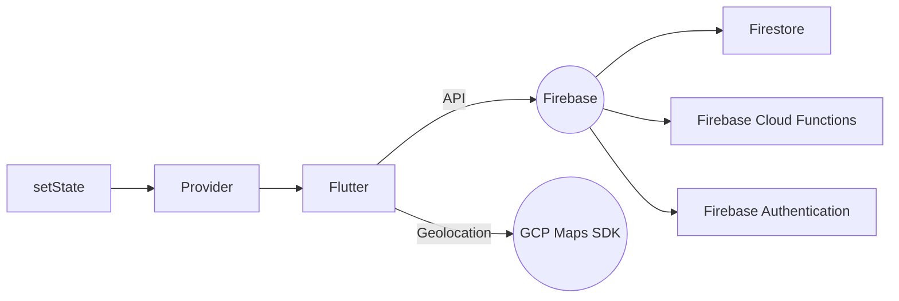

# Milo (Emergency Ambulance System) 

A new Flutter project for the ineuron.ai Hack-A-Thon 2.0. This project is intended as a solution to the Ambulance problem statement.

## Full stack server-less architecture


Here is the link to the [youtube demo](https://www.youtube.com/watch?v=DqebOWyLQPc&ab_channel=loganw1ck).
## Features (At design stage)
```

 - User CRUD
 - Patients can see all the available ambulances in a given periphery
 - Drivers can see all the emergency cases around them
 - If permited by the patient then the ambulance driver would have access to the patients medical profile who he is going to pick up.
 - Patients have the option to add multiple medical profiles of their close which would be helpful in few cases.
 - Directions to the patients live location from the Drivers source 
```
