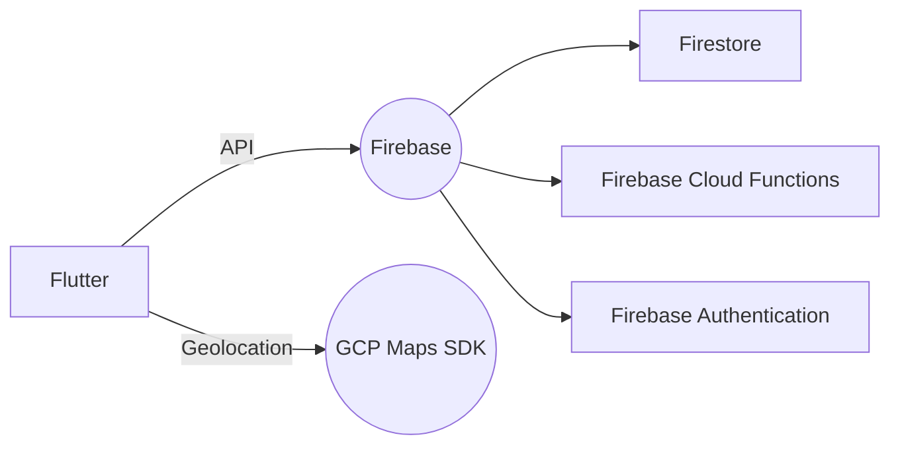

# Milo

A new Flutter project for the ineuron.ai Hack-A-Thon 2.0.

## Full stack server-less architecture

```mermaid
graph LR
A[Flutter]--API-->B((Firebase))
B-->C[Firestore]
B-->D[Firebase Cloud Functions]
B-->E[Firebase Authentication]
A--Geolocation-->F((GCP Maps SDK))
```
